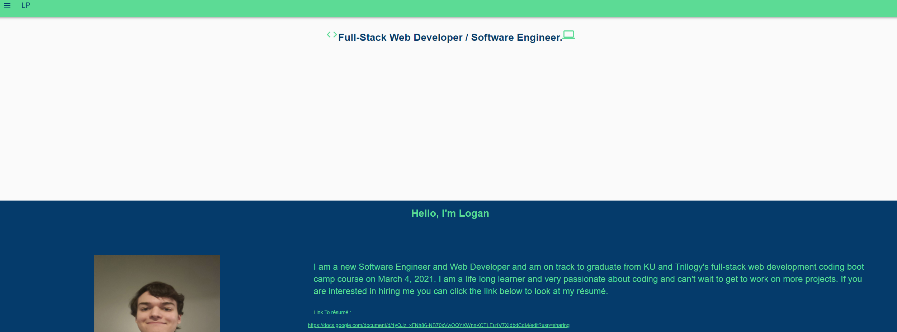

# React-Portfolio

## Table of Contents

- [Description](#Description)
- [Installation](#Installation)
- [Usage](#Usage)
- [License](#License)
- [Contribution](#Contribution)
- [Tests](#Tests)
- [Questions](#Questions)

## Description

This is my Portfolio website that I will use to show employers my some of my skills and talks about some of my basic information.

## Screenshots

-home screen

-Projects

## Installation

you don't need to install anything you can use the site as is.

## Usage

you can go to the website and look at my projects if you click the drawer it will take you to the different pages.

## License

## Contributing

You don't need to contrubute but if you want to you can email me.

## Tests

none

## Questions

- GitHub Username: [LoganPippin](github.com/LoganPippin)
- Email: logan.pippin32@gmail.com
